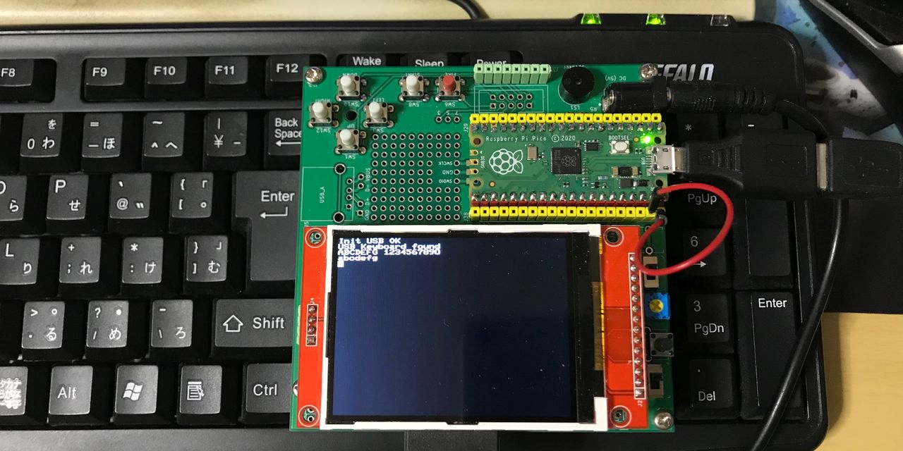

# USB keyboard driver for Rapsberry Pi Pico with TinyUSB
ラズベリーパイPicoのUSBコネクタにUSBキーボードを接続して利用するためのドライバです。  
ただし、現時点で動作は不安定で一切の保証いたしません。  
  

## 利用環境
・Raspberry Pi Pico  
　互換機YD-RP2040などでは利用できません。  
・TinyUSB バージョン 0.14.0  
　以前のバージョンや今後のバージョンで動作するかはわかりません。  
  
## 利用方法
動作プログラムをUSBケーブル経由で書き込み後ケーブルを抜き、代わりにUSBキーボードを接続した後、ラズベリーパイPico基板のVBUS端子（40番ピン）に＋5V電源を供給します。  
プログラムの記述方法はmain.cを参照ください。  
  
初期化変数  
　lockkey　下位3ビットが　SCRLK / CAPSLK / NUMLKを表す  
　keytype　0：日本語109キー　1：英語104キー  
  
main.cの動作には下記からファイルをダウンロードし、../lcd-lib/ディレクトリに入れておく必要があります。  
https://github.com/KenKenMkIISR/Pico-LCD-Text-Graph  
ili9341_spi.c  
graphlib.c  
fontdata.c  
LCDdriver.h  
graphlib.h  
  
## 制限事項
・リセット時に認識しないことが多い（キーボードによる）  
・キーボードの抜き差しでストールことがある  
・Lock関連キーの連打でLED点灯・消灯しなくなることがある  
